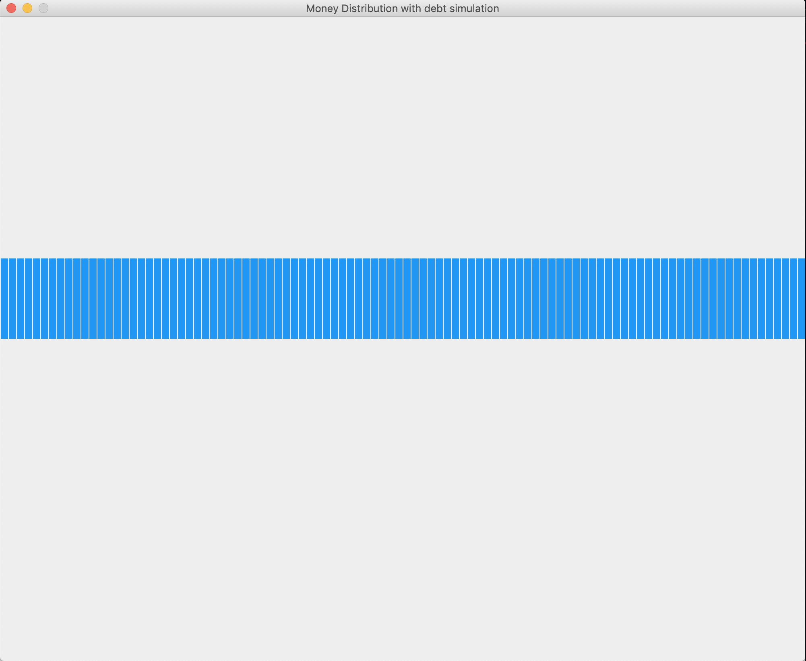
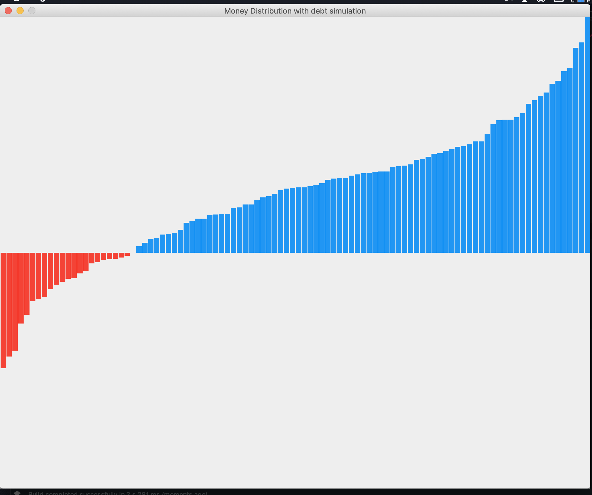

# Money_Distribution_Problem_Simulation
### Blue meams positive value, red means negative value(debt)
### Learn more: [Counterintuitive problem: Everyone in a room keeps giving dollars to random others. You’ll never guess what happens next.](http://www.decisionsciencenews.com/2017/06/19/counterintuitive-problem-everyone-room-keeps-giving-dollars-random-others-youll-never-guess-happens-next/)
### Learn more: [Statistical mechanics of money](http://www2.physics.umd.edu/~yakovenk/papers/EPJB-17-723-2000.pdf)
 
## Preview: 
1. At the beginning, everyone's money is the same:

2. After a while:

 
